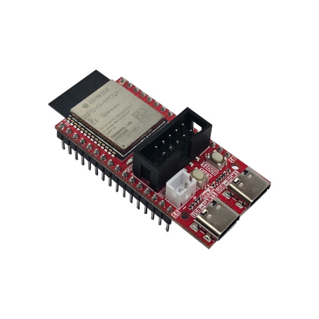

# ESP32-C5-DevKit-Lipo
Dual band 2.4Ghz and 5Ghz WiFi 6, Bluetooth 5 LE, Zigbee, Thread, Matter development board UEXT, USB programming, USB JTAG and LiPo battery UPS

https://www.olimex.com/Products/IoT/ESP32-C5/ESP32-C5-DevKit-Lipo/open-source-hardware

Features:

* 32 bit RISC-V processor 240Mhz
* Dual-Band Wi-Fi (2.4 GHz + 5 GHz)
* Bluetooth 5, Zigbee, Thread, Matter
* 8 MB Flash + 4 MB RAM
* UEXT connector
* USB-C (Power & Debug)
* USB-C JTAG
* Boot & Reset buttons
* Extension connector
* 0.9" (22.86 mm) space between the headers
* LiPo UPS charger & step-up converter
* Status LEDs
* Two mouting holes
* Dimensions 53x25mm

## Licenses

* Hardware is released under CERN Open Hardware Licence Version 2 - Strongly Reciprocal, all silkscreen credits to Olimex should remain;
* Software is released under MIT Licensee
* Documentation is released under CC BY-SA 4.0
